# Docker 基础总结

## 一、docker概念

docker是一个开源的应用容器引擎，让开发者可以打包他们的应用以及依赖包到一个可移植的镜像中，然后发布到任何留下的linux或windows机器上，也可以实现虚拟化，容器是完全使用沙箱机制，互相之间不会有任何接口。docker的基础是Linux容器（LXC）等技术。

docker的设计思想，是基于集装箱的原理设计。不同集装箱的环境和依赖之间是不冲突的。

由于虚拟机开销比较高，docker可以实现虚拟机隔离应用环境的功能，并且开销比较小，小就意味着省钱。docker启动是秒级的，非常快。docker对系统资源的利用率非常高，一个主机上可以运行数千个容器。

1. 更快的交付和部署
2. 更方便的扩展和迁移
3. 更简单的管理

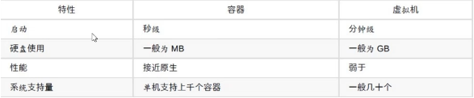

举个例子：

正常一个程序运行在linux上需要一下几步：

1. 准备一个linux环境
2. 安装环境依赖，JDK，nodejs等
3. 安装程序运行服务器，tomcat，pm2，mysql等
4. 部署项目代码。

如果在多台服务器上部署，就需要将上面的步骤都重复一遍，很不方便并且很有可能出错。导致项目部署失败。

使用docker之后，只需要将一份部署好的程序打包成镜像。其他服务器主机只需要加载并启动一下就可以直接运行。相当于复制功能。可以大大缩减运维的时间。

复制来的环境就叫`镜像`，镜像运行在`容器`中。

镜像中包括程序运行的所有环节，包括操作系统，软件依赖等

docker的局限性：

1. docker是基于linux 64位开发的，无法在32位的系统环境下使用。
2. docker要求centos内核必须为3.10以上，否则无法使用，可以使用`uname -r`查看
3. LXC是基于cgroup等linux kernel功能的，因此container的guest系统只能是linux base的
4. 网络隔离相对简单，基于namespace隔离
5. container随着用户进程的停止而销毁，container中的log等用户数据不方便收集

## 二、docker安装

docker官网： https://www.docker.com/

远程仓库docker Hub官网： https://hub.docker.com/

#### 1. 环境要求

centos的话，系统为64位，内核为3.10以上

可以使用，查看

```javascript
uname -r
```

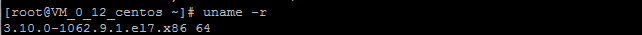

#### 2. docker的基本组成

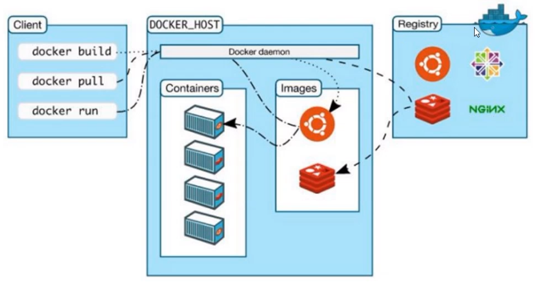

#### 3. docker下载

官网教程：https://docs.docker.com/engine/install/centos/

3.1 如果是虚拟机，需要安装gcc

```
# 确定虚拟机能上外网，阿里云等已经默认装了
yum -y install gcc
yum -y install gcc-c++
```

3.2  卸载旧版本

```
yum remove docker \
docker-client \
docker-client-latest \
docker-common \
docker-latest \
docker-latest-logrotate \
docker-logrotate \
docker-engine
```

3.2 安装docker

```
yum install -y docker
```

3.3 检查版本

```
docker -v
```

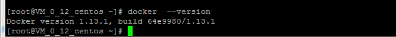

3.4 设置开机启动

```
systemctl enable docker
```

3.5  启动、停止、重启docker

```
# 启动，只有启动了才能使用
systemctl start docker

# 停止
systemctl stop docker

# 重启
systemctl restart docker
```

#### 4. docker 测试hello-world

基于上面3.5的docker启动命令。下载一个docker官方提供的测试hello-world镜像。此步骤可以不用做。

4.1 下载镜像

```
# 下载
docker pull hello-world

# 查看是否存在
docker images
```

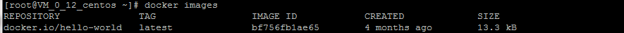

4.2  运行容器

```
# bf756fb1ae65是镜像的ID，也可以直接使用镜像的名字hello-world
docker run 镜像ID
```

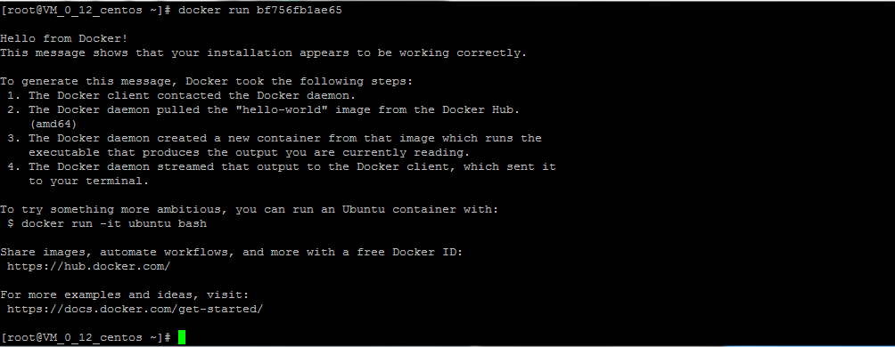

4.3 查看容器状态

​	由于docker 的运行机制，在容器内必须要有一个持续运行的应用，否则docker会把容器状态置为Exited状态。所以这里要使用docker ps -a，直接使用docker ps 是看不到的

```
# 查看运行中的容器
docker ps

# 查看全部的容器，包括：运行中、暂停、停止等状态
docker ps -a
```

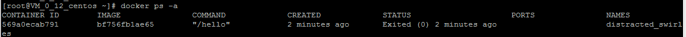

4.3  删除hello-world容器

```
docker rm -f 容器ID
```

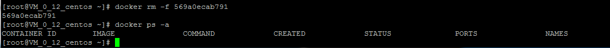

4.4 删除hello-world镜像

```
docker rmi 镜像ID
```

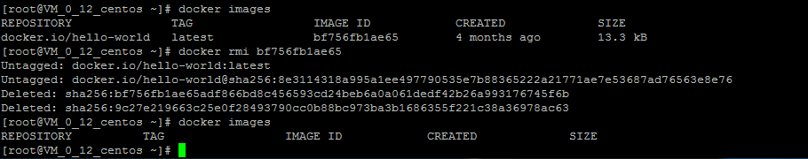

#### 5. 配置加速

docker运行容器需要本地存在对应的镜像，如果镜像不存在，docker会从镜像仓库进行下载。默认是docker hub公共注册服务器中的仓库。

但是由于网络原因，会导致下载很慢，一般国内使用 `阿里云` 或者`其他`的加速配置:

5.1 阿里云加速服务

https://cr.console.aliyun.com/cn-hangzhou/instances/mirrors

登陆阿里云，搜索`容器镜像加速`,

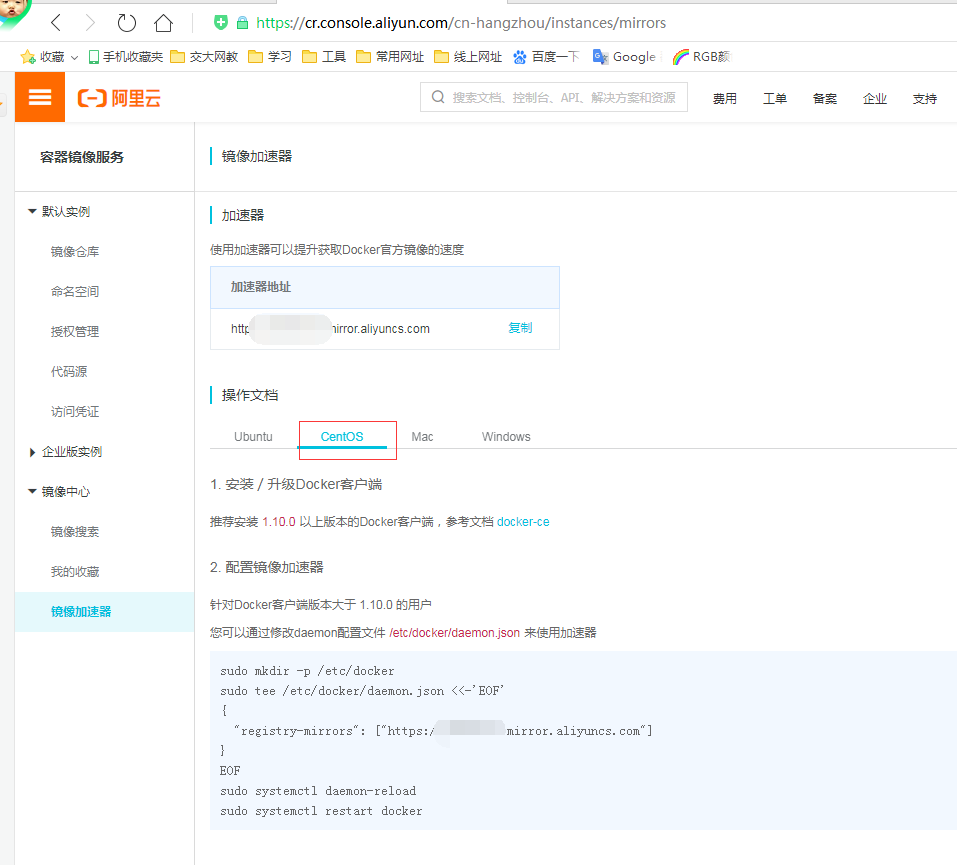

编辑刷新daemon.json,并重启docker。

5.2 daocloud加速服务

地址：https://www.daocloud.io/mirror

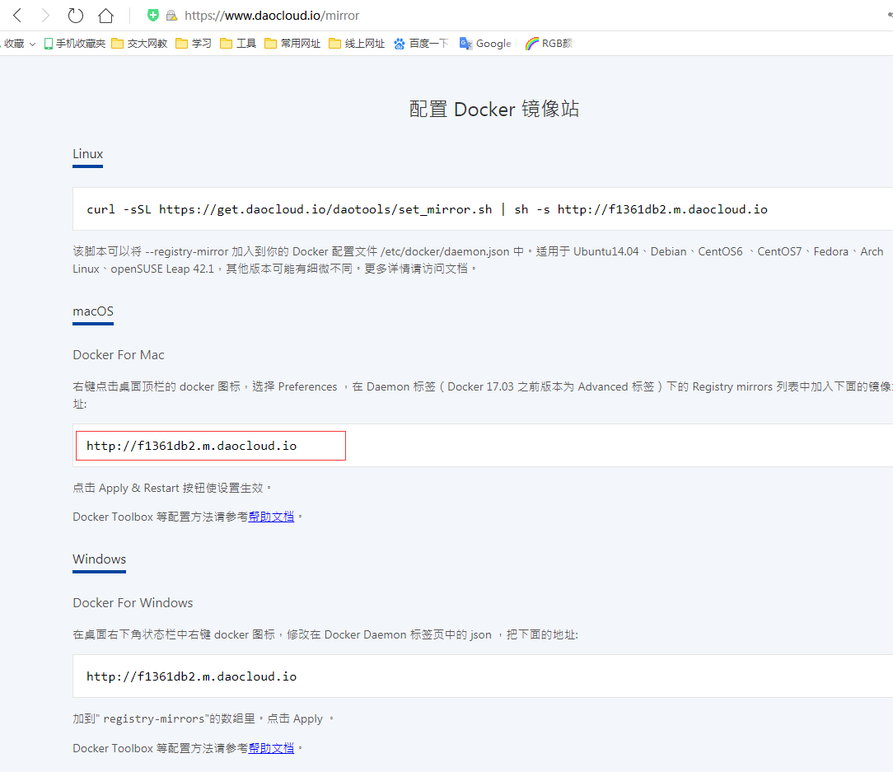

将上面的地址，替换掉 daemon.json 里面的阿里云地址，刷新并重启

## 二、docker底层运行原理

### 1. docker是如何工作的

docker是一个C/S(client-server)架构模型的系统，docker守护进程运行在主机上，然后通过scoket连接从客户端访问，守护进程从客户端接受命令并管理运行在主机上的容器。容器是一个运行时环境，就是我们上面说的集装箱。

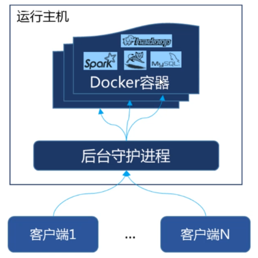

### 2. docker run了啥

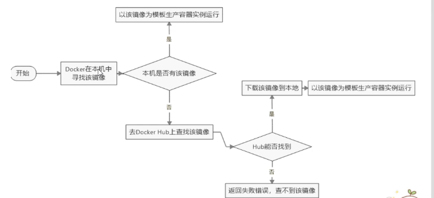

## 三、docker命令

### 1. 帮助命令

#### 1.1 查看简单版本

```
docker -v
```

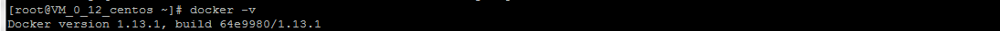

#### 1.2 查看详细版本信息

```
docker version
```

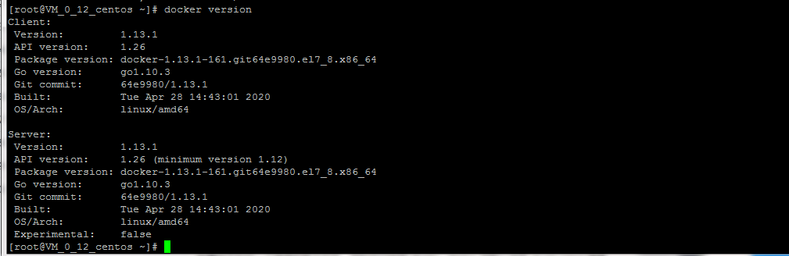

#### 1.3 显示全系统信息

```
docker info
```

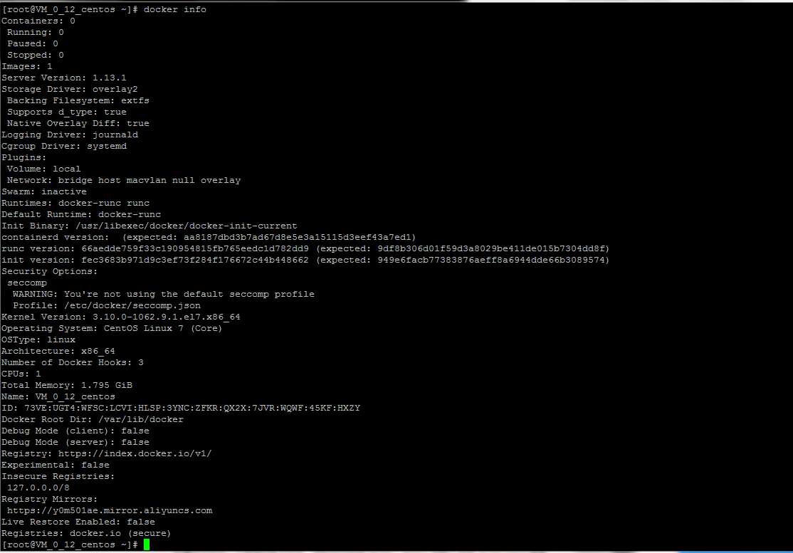

#### 1.4 docker 帮助命令

```
docker --help
```

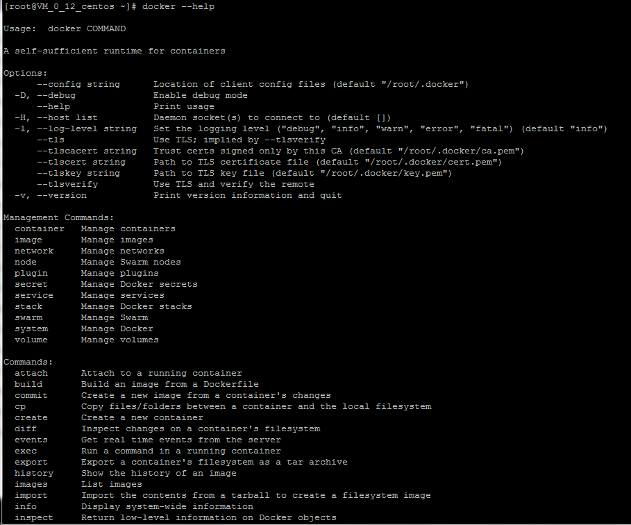

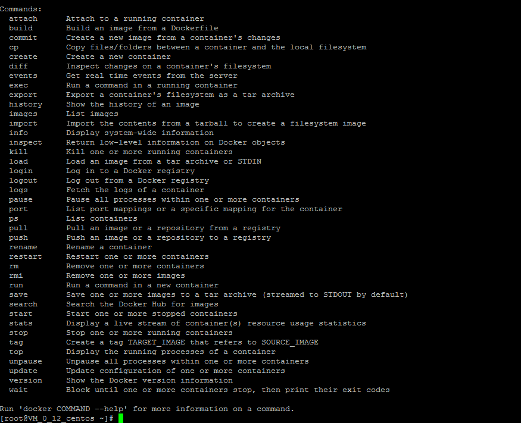

### 2. 镜像命令

备注：所有命令中有-[option] 都是可选项，不输入也没有影响

#### 2.1 查找搜索镜像

```
docker search 镜像名 -[option]

-[option]值如下：

--no-trunc: 显示完整的镜像信息
-s: 列出收藏数不少于指定收藏stars值的镜像
--automated: 只列出automated build类型的镜像
```

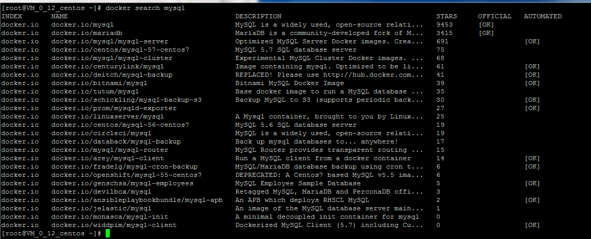

```
INDEX: 序号
NAME: 名称
DESCRIPTION: 介绍
STARS: 点赞数类似于github 的stars
OFFICIAL: 是否官方出品
AUTOMATED: 是否支持自动化

```


#### 2.2 下载镜像

版本号如果不写，默认版本号最新版本latest，也可以下载固定的版本号如 mysql:5.7,

```
docker pull 镜像名:版本号

例如：
docker pull mysql:5.7
```

#### 2.3 列出本机上的镜像

```
# 旧版本
docker images -[options]

-[option]值如下：

-a: 列出本地所有的镜像及子镜像
-q: 只显示镜像ID
--digests: 显示镜像的摘要信息
--no-trunc: 显示完整的镜像信息

```
```
# 新版本
docker image ls
```

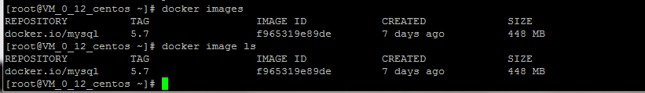

```
REPOSITORY: 表示镜像的仓库源
TAG: 镜像的标签版本号
IMAGE ID: 镜像的ID，在镜像仓库里面的最后一次修改ID
CREATED: 镜像的创建时间
SIZE: 镜像大小
```

#### 2.4 删除镜像

```
# 删除单个
docker rmi -f 镜像ID

docker rmi -f 镜像名:版本号

# 删除多个
docker rmi -f 镜像ID1 镜像ID2

# 删除全部
docker rmi -f $(docker images -qa)
```

-f 表示强制删除，如果镜像在run状态中，删除镜像就需要加上-f。

