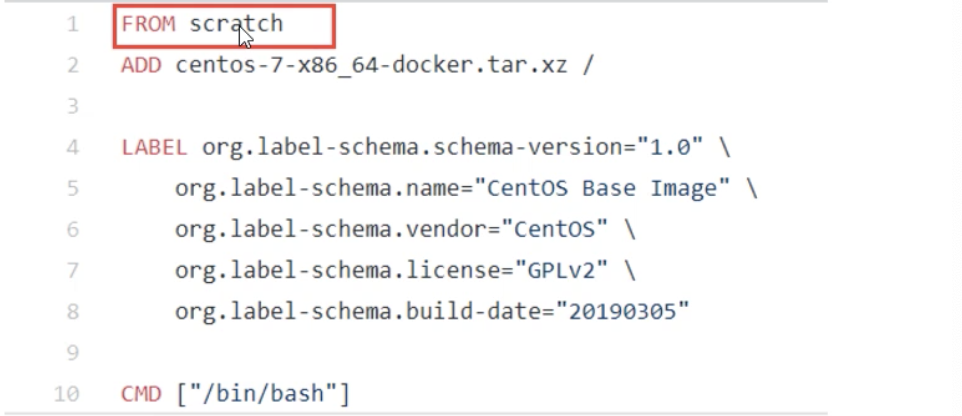
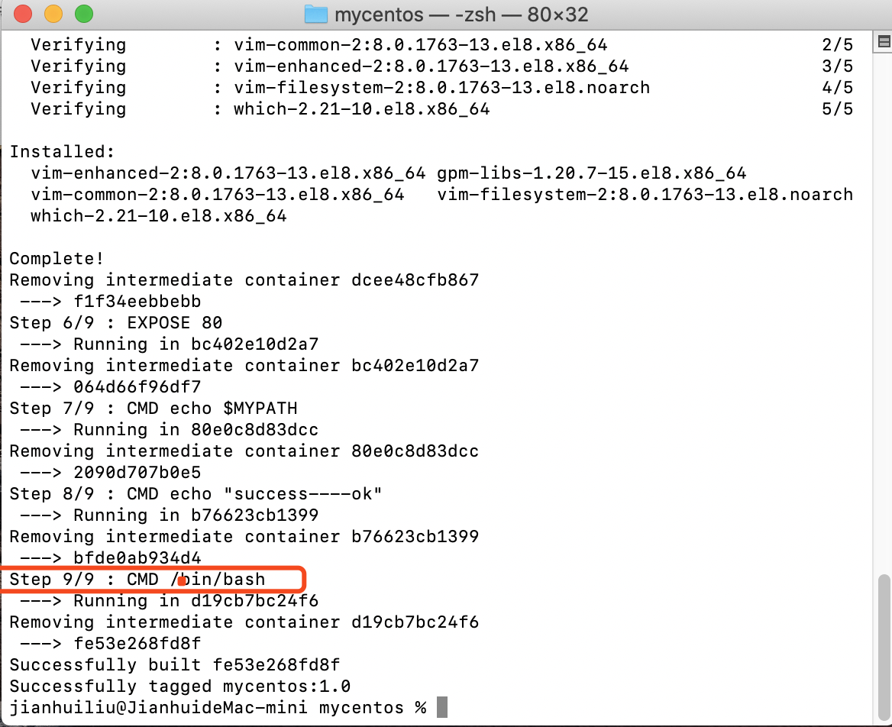

# Docker 基础总结

## 一、docker概念

docker是一个开源的应用容器引擎，让开发者可以打包他们的应用以及依赖包到一个可移植的镜像中，然后发布到任何留下的linux或windows机器上，也可以实现虚拟化，容器是完全使用沙箱机制，互相之间不会有任何接口。docker的基础是Linux容器（LXC）等技术。

docker的设计思想，是基于集装箱的原理设计。不同集装箱的环境和依赖之间是不冲突的。

由于虚拟机开销比较高，docker可以实现虚拟机隔离应用环境的功能，并且开销比较小，小就意味着省钱。docker启动是秒级的，非常快。docker对系统资源的利用率非常高，一个主机上可以运行数千个容器。

1. 更快的交付和部署
2. 更方便的扩展和迁移
3. 更简单的管理


举个例子：

正常一个程序运行在linux上需要一下几步：

1. 准备一个linux环境
2. 安装环境依赖，JDK，nodejs等
3. 安装程序运行服务器，tomcat，pm2，mysql等
4. 部署项目代码。

如果在多台服务器上部署，就需要将上面的步骤都重复一遍，很不方便并且很有可能出错。导致项目部署失败。

使用docker之后，只需要将一份部署好的程序打包成镜像。其他服务器主机只需要加载并启动一下就可以直接运行。相当于复制功能。可以大大缩减运维的时间。

复制来的环境就叫`镜像`，镜像运行在`容器`中。

镜像中包括程序运行的所有环节，包括操作系统，软件依赖等

docker的局限性：

1. docker是基于linux 64位开发的，无法在32位的系统环境下使用。
2. docker要求centos内核必须为3.10以上，否则无法使用，可以使用`uname -r`查看
3. LXC是基于cgroup等linux kernel功能的，因此container的guest系统只能是linux base的
4. 网络隔离相对简单，基于namespace隔离
5. container随着用户进程的停止而销毁，container中的log等用户数据不方便收集

## 二、docker安装

docker官网： https://www.docker.com/

远程仓库docker Hub官网： https://hub.docker.com/

#### 1. 环境要求

centos的话，系统为64位，内核为3.10以上

可以使用，查看

```javascript
uname -r
```


#### 2. docker的基本组成


#### 3. docker下载

官网教程：https://docs.docker.com/engine/install/centos/

3.1 如果是虚拟机，需要安装gcc

```
# 确定虚拟机能上外网，阿里云等已经默认装了
yum -y install gcc
yum -y install gcc-c++
```

3.2  卸载旧版本

```
yum remove docker \
docker-client \
docker-client-latest \
docker-common \
docker-latest \
docker-latest-logrotate \
docker-logrotate \
docker-engine
```

3.2 安装docker

```
yum install -y docker
```

3.3 检查版本

```
docker -v
```


3.4 设置开机启动

```
systemctl enable docker
```

3.5  启动、停止、重启docker

```
# 启动，只有启动了才能使用
systemctl start docker

# 停止
systemctl stop docker

# 重启
systemctl restart docker
```

#### 4. docker 测试hello-world

基于上面3.5的docker启动命令。下载一个docker官方提供的测试hello-world镜像。此步骤可以不用做。

4.1 下载镜像

```
# 下载
docker pull hello-world

# 查看是否存在
docker images
```


4.2  运行容器

```
# bf756fb1ae65是镜像的ID，也可以直接使用镜像的名字hello-world
docker run 镜像ID
```


4.3 查看容器状态

​	由于docker 的运行机制，在容器内必须要有一个持续运行的应用，否则docker会把容器状态置为Exited状态。所以这里要使用docker ps -a，直接使用docker ps 是看不到的

```
# 查看运行中的容器
docker ps

# 查看全部的容器，包括：运行中、暂停、停止等状态
docker ps -a
```


4.3  删除hello-world容器

```
docker rm -f 容器ID
```


4.4 删除hello-world镜像

```
docker rmi 镜像ID
```


#### 5. 配置加速

docker运行容器需要本地存在对应的镜像，如果镜像不存在，docker会从镜像仓库进行下载。默认是docker hub公共注册服务器中的仓库。

但是由于网络原因，会导致下载很慢，一般国内使用 `阿里云` 或者`其他`的加速配置:

5.1 阿里云加速服务

https://cr.console.aliyun.com/cn-hangzhou/instances/mirrors

登陆阿里云，搜索`容器镜像加速`,


编辑刷新daemon.json,并重启docker。

5.2 daocloud加速服务

地址：https://www.daocloud.io/mirror


将上面的地址，替换掉 daemon.json 里面的阿里云地址，刷新并重启

## 二、docker底层运行原理

### 1. docker是如何工作的

docker是一个C/S(client-server)架构模型的系统，docker守护进程运行在主机上，然后通过scoket连接从客户端访问，守护进程从客户端接受命令并管理运行在主机上的容器。容器是一个运行时环境，就是我们上面说的集装箱。


### 2. docker run了啥


## 三、docker命令

### 1. 帮助命令

#### 1.1 查看简单版本

```
docker -v
```


#### 1.2 查看详细版本信息

```
docker version
```


#### 1.3 显示全系统信息

```
docker info
```


#### 1.4 docker 帮助命令

```
docker --help
```


### 2. 镜像命令

备注：所有命令中有-[option] 都是可选项，不输入也没有影响

#### 2.1 查找搜索镜像

```
docker search 镜像名 -[option]

-[option]值如下：

--no-trunc: 显示完整的镜像信息
-s: 列出收藏数不少于指定收藏stars值的镜像
--automated: 只列出automated build类型的镜像
```


```
INDEX: 序号
NAME: 名称
DESCRIPTION: 介绍
STARS: 点赞数类似于github 的stars
OFFICIAL: 是否官方出品
AUTOMATED: 是否支持自动化

```


#### 2.2 下载镜像

版本号如果不写，默认版本号最新版本latest，也可以下载固定的版本号如 mysql:5.7,

```
docker pull 镜像名:版本号

例如：
docker pull mysql:5.7
```

#### 2.3 列出本机上的镜像

```
# 旧版本
docker images -[options]

-[option]值如下：

-a: 列出本地所有的镜像及子镜像
-q: 只显示镜像ID
--digests: 显示镜像的摘要信息
--no-trunc: 显示完整的镜像信息

```
```
# 新版本
docker image ls
```


```
REPOSITORY: 表示镜像的仓库源
TAG: 镜像的标签版本号
IMAGE ID: 镜像的ID，在镜像仓库里面的最后一次修改ID
CREATED: 镜像的创建时间
SIZE: 镜像大小
```

#### 2.4 删除镜像

```
# 删除单个
docker rmi -f 镜像ID

docker rmi -f 镜像名:版本号

# 删除多个
docker rmi -f 镜像ID1 镜像ID2

# 删除全部
docker rmi -f $(docker images -qa)
```

-f 表示强制删除，如果镜像在run状态中，删除镜像就需要加上-f。

### 3. 容器命令

Docker 容器后台运行，就必须要有一个前台进程，可以使用如top，tail等命令一直挂起

例如如果直接执行`docker run centos` 由于centos里面没有运行的程序，会导致centos运行完就退出。

`docker ps`是没有centos运行的，使用`docker ps -a` 发现容器已经是退出状态。


所以这时候就需要在前台运行。

所以需要如下命令方式运行centos：

```
docker run -it --name mycentos01 centos /bin/bash
```


就会发现已经进入到centos容器的内部了。

退出容器内部使用：

```
# 退出并关闭
exit

# 退出不关闭
ctrl+p+q
```


#### 3.1 run命令

```
docker run [option] 镜像名:版本号或镜像id [command][args]
```

options参数说明：

注意：有些是一个减号，有些是两个减号

```
--name: 为容器指定一个名字。
-d: 后台运行容器，并返回容器ID，也即启动守护式容器。
-i: 以交互模式运行容器，通常与-t同时使用。
-t: 为容器重新分配一个伪输入终端，通常与-同时使用。
-P: 随机端口映射
-p: 指定端口映射，有以下四种格式
		ip:宿主机端口:容器端口
		ip::容器端口
		宿主机端口:容器端口(常用，例如：-p 8080:9000)
		容器端口
		
-v: 指定挂载主机目录到容器目录，默认为 rw 读写模式， ro表示只读模式。例如：
		-v 主机目录:宿主目录:rw|ro
-e: 配置环境变量
		

```

#### 3.2 查看容器

列出正在运行的容器

```
docker ps [-option]
```

option可选参数：

```
-a: 显示所有运行和没有运行的容器
-l: 显示最近创建的容器
-n: 显示最近n个创建的容器
-q: 静默模式，只显示容器编号
--no-trunc: 不截断输出
```

#### 3.3 对容器启动停止操作

重启：

```
docker restart 容器ID或者容器名字:版本号
```

启动：

```
docker start 容器ID或者容器名字:版本号
```

停止：

```
docker stop 容器ID或者容器名字:版本号
```

强制停止容器：

```
docker kill 容器ID或者容器名字:版本号
```

删除已停止的容器：

```
# 删除单个
docker rm 容器ID

# 删除多个
docker rm -f $(docker ps -aq)
或者
docker ps -ap xargs docker rm

-f是强制删除正在运行的容器
```

#### 3.4 查看容器日志

先运行一个程序，在后台每隔2s输出[hello world]

```
docker run -d centos /bin/sh -c "while true;do echo hello world;sleep 2;dome"
```

查看日志：

```
docker logs -tf --tail 10 容器ID

参数：
-t: 加入时间戳
-f: 跟随最新的日志打印
--tail: 数字，显示最后多少条

```

#### 3.5 查看容器运行进程

```
docker top 容器ID
```

#### 3.6 查看容器内部细节

```
docker inspect 容器ID
```

#### 3.7 进入正在进行的容器并以命令行交互

```
# 方式1
docker exec -it 容器ID /bin/bash

# 方式2
docker attach 容器ID

两种方式的区别
exec 在容器中打开新的终端，并且可以启动新的进程
attch 直接进行容器终端，不会启动新的进程，使用exit会出退并关闭
```

在上面，使用ctrl+p+q的方式退出的容器，可以使用attach就可以再次进入。

#### 3.8 进入容器和主机互相拷贝文件

```
#从主机文件拷贝到容器中
docker cp 主机文件路径 容器ID或容器名:容器路径 

#从容器中文件拷贝到主机中
docker cp 容器ID或容器名:容器路径 主机文件路径 
```

### 4. 容器数据卷

#### 4.1 什么是容器数据卷

先来看看docker的理念：

* 将应用于运行的环境打包形成容器运行，运行可以伴随着容器，但是我们对数据的要求是持久化的
* 容器之间希望有可能共享数据

docker容器产生的数据，如果不通过docker commit 生成新镜像，使得数据作为镜像的一部分保存下来，那么容器删除后，数据自然也就没有了。

为了能保存数据在docker中我们使用卷

#### 4.2 容器数据卷能做什么

1. 容器数据的持久化
2. 容器之间基础和共享数据

#### 4.3 添加数据卷的方式

##### 4.3.1 直接使用命令添加

情景：

给tomcat镜像添加数据卷挂载，使得webapps目录，可以通过在宿主机里面添加内容来实现tomcat项目部署

1. 语法：

   主要是 `-v /宿主机目录:/容器内目录` ，

    *mac os 系统下需要在 Docker -> preference -> Resource -> file sharing中添加该目录，才能进行挂载！*

   

   ```
   docker run -it -v /宿主机目录:/容器内目录 镜像ID或镜像名:版本号 /bin/bash
   ```

   挂载目录:

   ```
   docker run -it -d \
   -p 8888:8080 \
   -v \ /Users/jianhuiliu/Desktop/docker_data/tomcat/webapps:/usr/local/tomcat/webapps \ eb2cfb95e04d
   ```

   由于演示系统是mac os,这里将docker里面的tomcat webapps 目录(`/usr/local/tomcat/webapps`)挂载到mac的`/Users/jianhuiliu/Desktop/docker_data/tomcat/webapps`文件夹

   


2. 查看挂载是否成功

   

   ```
   docker inspect 镜像ID
   ```

     

3. 给宿主机的webapps文件夹添加一个demo文件夹，在里面创建index.html文件。

   

4. 我们进入到容器内部去，在容器的tomcat->webapps下面会发现也有aaa文件夹和index.html文件。

   说明宿主机的webapps文件夹和容器的webapps文件夹已经挂载联通成功。

   **注意：还是需要注意的地方，此时进入容器 我们要使用exec新开一个 bash命令行去查看路径，所以不能使用attach，除非上一次进入的时候是打开了一个新的bash命令行,并且是ctrl+p+q退出的。**

   ```
   docker exec -it 镜像ID /bin/bash
   ```

   

5. 浏览器直接检测效果：

   

   所以就达到了，在宿主机部署项目，挂载到docker容器的目的。

6. 权限

   `如果出现宿主机内不能修改的问题在 run 挂载的时候添加上`

   `--privileged=true`

   

   `可以设置 -v 的权限为ro，默认是rw读写模式`

   

##### 4.3.2 使用dockerfile方式添加

1.  在宿主机root下创建一个docker文件夹。
2. 进入docker文件夹创建一个名为Dockerfile的文件
3. 编写Dockerfile
4. 使用Dockerfile生成自定义镜像

##### 4.3.3 容器间数据共享

1. 创建宿主机目录
2. 将多个容器挂载到这个目录，就能实现容器之间的数据共享。容器之间是否是继承对宿主机无影响
3. 就可以实现容器间数据共享

情景：

​		创建宿主机目录，将os1挂载到这个目录，然后创建os2继承os1，创建os3继承os2。

具体步骤：

创建Dockerfile:


使用Dockerfile构建镜像

```
docker build -t mytomcat01:1.0 .  # 注意最后面有一个小数点
```

使用自己创建的镜像启动一个容器

```
docker run -it -name=os1 mytomcat01:1.0 /bin/bash
```

使用自己创建的镜像启动第二个容器，它继承第一个

```
docker run -it -name=os2 --volumes-from os1 mytomcat01:1.0 /bin/bash
```

使用自己创建的镜像启动第三个容器，它继承第二个

```
docker run -it -name=os3 --volumes-from os2 mytomcat01:1.0 /bin/bash
```

**测试方法1：**

1.在os1里面创建os1.txt

2.在os2里面创建os2.txt

3.进入os3发现同时存在os1.txt和os2.txt

**测试方法2：**

1.删除os1容器 之后

2.os2和os3里面的数据不会发生变化

原因是，由于os1，os2, os3 虽然是继承关系，但是实际的文件是在宿主机里面，虽然吧容器删了

，但是对宿主机里面的文件没有影响，所以os2和os3里面依旧可以看到os1.txt，os2.txt，os3.txt

### 5. 命令总结


## 四、 docker镜像详解

### 1. 什么是镜像

#### 1.1 UnionFS(联合文件系统)

UnionFS是一种分层的，轻量级并且高性能的文件系统，它支持对文件系统的修改作为一次提交来一层层的叠加，同时可以将不同目录挂载到同一个虚拟文件系统下。Union文件系统是docker镜像的基础，镜像可以通过分层来进行继承，基于镜像基础(没有父镜像)，可以制作各种具体的应用镜像。

特性：一次同时加载多个文件系统，但从外面看来，只能看到一个文件系统，联合加载会把各层文件系统叠加起来，这样最终的文件系统会包含所有底层的文件和目录。

#### 1.2 docker镜像加载原理

docker的镜像实际是由一层一层的文件系统组成。


* bootfs：主要是boot加载器和内核。
* rootfs：是各种不同操作系统的发行版本，如ubuntu,centos等。

#### 1.3 分层镜像

以pull为例，在下载的过程中我们可以看到docker 镜像好像是一层一层的在下载。


#### 1.4 为什么使用分层结构

最大的好处就是资源共享

比如：有多个镜像都从相同的base镜像构建而来，那么宿主机只需在磁盘上保存一份base镜像。同时内存中也只需要加载一份base镜像，就可以为所有容器服务了，而镜像中的每一层都可以被共享。

### 2. 镜像的特点

`docker镜像都是只读的`。但是容器可以改。

当容器启动时候，一个新的可写的镜像被加载到镜像层的顶部。这一层叫做容器层，容器层之下的都叫镜像层

### 3. 镜像的commit操作

#### 3.1 作用 

当镜像运行之后可以修改容器里面的内容，在提交成一个新的镜像。

#### 3.2 制作镜像命令语法

```
docker commit -m="新镜像的描述" -a="作者" 源容器ID 要创建的目标镜像名:标签名
```

#### 3.3 案例演示

场景：

在某些版本的tomcat下，直接启动tomcat，在游览器会出现404，没有tomcat 的主页面，原因是 tomcat 的webapps目录下没有文件，文件在webapps.dist 文件夹里面，我们需要先将webapps.dist里面的文件移动到webapps里面去，然后将新的tomcat打包成镜像。


1. 下载docker hub的tomcat

   ```
   docker pull tomcat:8.5
   
   docker images
   ```

   

2. 启动原始的tomcat镜像。

   ```
   docker run -it -d -p 8889:8080 tomcat:8.5 
   ```

   

   在浏览器输入 `宿主机ip:8889` 发现是404页面。

   

3. 原因排查

   首先，由于tomcat 是一个阻塞式的应用程序。

   我们使用docker run -d 启动起来的应用，如果直接使用 `docker attach 容器ID` 进去看到的是tomcat的进程日志。

   ```
   docker attach 容器ID
   ```

   

   但是我们需要在命令行输入命令查看tomcat 的目录，就只能使用：

   ```
   docker exec -it 容器ID /bin/bash
   ```

   

   可以看出webapps下面是没有什么内容的，但是webapps.dist下面有内容。

4. 解决404问题

   1. 移除webapps文件夹

      ```
      rm -rf webapps
      ```

      

   2. 修改webapps.dist文件夹名字为 webapps

      ```
      mv webapps.dist webapps
      ```

      

   3. 刷新浏览器，恢复正常

      

   4. ctrl+p+q退出容器，注意容器不能使用exit 会关闭。

5. 重新制作镜像。

   我们把这次的修改保存成一个新的镜像，以后就可以直接使用了，不用每次都修改webapps文件夹。

   ```
   docker commit -m "新的tomcat" -a "victor.liu" 源镜像ID 新镜像名:版本号
   ```

   

   


## 五、Dockerfile详解

### 1. 什么是Dockerfile

1. Dockerfile是用来构建docker镜像的构建文件，是由一系列的命令和参数构建而成的脚本。

2. Dockerfile的构建步骤：

   编写Dockerfile文件；

   docker build 生成新的镜像；

   docker run 运行镜像；

### 2. Dockerfile构建解析过程

1. 基础知识
   1. 每条关键字指令都必须为大写字母，后面要跟随至少一个参数。
   2. 指令从上到下顺序执行
   3. #表示注释
   4. 每条指令都会创建一个新的镜像层，并对镜像进行提交

2. 大致流程
   1. docker从基础镜像运行一个容器
   2. 执行一条指令并对容器进行修改
   3. 执行类似于docker commit的操作提交一个新的镜像
   4. docker再基于刚提交的新镜像运行一个新的容器
   5. 执行Dockerfile的下一个指令再重执行第2点直到没有命令

3. 总结

   从应用软件的角度来开看，Dockerafile，docker镜像和docker容器分别代表了软件的三个不同阶段。

   * Dockerfile是软件的原材料
   * docker镜像是软件的交付品
   * docker容器是软件的运行态

   Dockerfile面向开发，docker镜像是交付标准，docker 容器则涉及部署和运维，三者缺一不可，合力充当docker体系的基石。

   

   Dockerfile需要定义一个Dockerfile文件，Dockerfile文件定义了进程需要的一切东西

    	Dockerfile涉及的内容包括：执行代码或文件，环境变量，依赖包，运行时环境，动态链接库，操作系统的发行版，服务进程和内核进程(当应用程序需要和系统服务和内核进程打交道时，就要考虑如何设计namespace的权限控制)等。

   

   在用Dockerfile定义一个文件后，docker build时会产生一个docker镜像。

   ​	当运行docker镜像时候，会真正开始提供服务；

   

   docker容器是直接提供服务的。

   ​	


### 3. Dockerfile关键字

1. `FROM` 基础镜像，当前新镜像是基于哪个镜像的

2. `MAINTAINER`  镜像维护者的姓名和邮箱地址

3. `RUN` 容器构建时需要运行的命令

4. `EXPOSE` 当前容器对外暴露的端口

5. `WORKDIR` 指定在创建容器后，终端默认登录进来的工作目录

6. `ENV` 用来在构建镜像过程中设置环境变量

7. `ADD` 将宿主机目录下的文件拷贝进镜像并且ADD命令会自动处理URL和解压tar包

8. `COPY` 类似ADD，拷贝文件和目录到镜像中，语法  COPY src dest COPY ["src","dest"]

9. `VOLUME` 容器数据卷，用来数据保存和持久化工作

10. `CMD` 指定一个容器启动时要运行的命令格式

    * shell 格式：CMD 命令；

    * exec 格式：CMD ["可执行文件","参数1","参数2"]；

    * 参数列表格式：CMD [“参数1”, “参数2”, …]，在指定了ENTRYPOINT 指令后，用CMD指定具体的参数。

     Docekrfile中可有多个CMD指令，但是只有最后一个生效，CMD会被docker run 之后的参数替换

11. `ENTRYPOINT` 指定一个容器启动时要运行的命令

    ENTRYPOINT的目的和CMD一样，都是在指定容器启动程序及参数；

12. `ONBUILD` 当构建一个被继承的Dockerfile时运行命令，父镜像在被子镜像继承后触发父镜像的onbuild

    

### 4.自己构建一个centos

1. base镜像的说明：

   docker hub 上99%的镜像都是通过base镜像中安装和配置需要的软件构建出来的，下图中的

   scratch 就是最底层的镜像。

   

2. 目的：(默认是不装的 yum可以使用)
   1. 配置登录后的默认路径
   2. 下载vim编辑器
   3. 查看网络配置ifconfg支持

3. 进入mydocker目录创建Dockerfile文件编写

   ```
   cd dockerfile
   mkdir mycentos
   cd mucentos
   touch Dockerfile
   chmod 777 Dockerfile
   
   # 查看当前全路径
   pwd
   # 查看文件夹文件
   ll
   # 查看文件内容
   cat 文件名
   # 给文件加权限
   chmod 777 文件名.后缀
   # 解压tar文件
   tar -zxvf jdk-linux-x64.tar.gz
   
   
   ```

   向Dockerfile 写入内容

   ```
   # 基于centos  docker pull centos，
   # 如果本地docker有centos镜像直接使用，没有就去pull下载
   FROM centos
   
   # 设置作者和邮箱
   MAINTAINER victor.liu<1103231037@qq.com>
   
   # 声明变量
   ENV MYPATH /usr/local
   
   # 设置工作目录 为上面定义的变量
   WORKDIR $MYPATH
   
   # 安装vim
   RUN yum -y install vim
   # ... 可以继续RUN 其他的命令
   
   # 对外暴露的端口，没有多大意义，纯属提示
   EXPOSE 80
   
   # 打开一个终端
   CMD echo $MYPATH
   CMD echo "success----ok"
   CMD /bin/bash
   ```

   

4. 使用build创建镜像

   ```
   
   # 默认加载的是当前文件夹下的 Dockerfile 文件，最后面小数点“.”表示当前文件夹, 
   # -t 表示指定生成的名称和版本
   # -f 表示加载指定的Dockerfile文件
   
   docker build -t 新镜像名:标签 .
   
   # 如果不想使用默认的Dockerfile名字，比如叫Demodockerfile，就需要加上-f 命令参数
   docker build -f /root/dockerfile/mycentos/Demodockerfile mucentos:1.0 .
   
   ```

   结果：，一共是9步骤，是因为有9行，每一行就是一个步骤。

   

   查看镜像：

   

   可以看到当前目录是 /usr/local，vim也是可以使用的

5. 列出镜像的变更历史

6. docker history 镜像名:TAG

   

   这里会出现9 步骤，跟上面的9步是对应的，没执行完一步就会生成一个镜像id

### 5. CMD命令说明

Docekrfile中可有多个CMD指令，但是只有最后一个生效，CMD会被docker run 之后的参数替换

以tomcat的Dockerfile为例：


从上面的可以看出最后执行科一个catalina.sh的命令，相当于执行了tomcat内部的 ./bin/catalina.sh,

运行如下命令，可以看出下图效果

```
docker run -it -p 9999:8080 tomcat /bin/bash
```


发现tomcat的容器启动之后就退出了，那是因为在启动容器的时候后面加了 /bin/bash 会覆盖Dockerfile里面的CMD ["catalina.sh", "run"]

### 6. ENTRYPOINT说明

使用ENTRYPONIT来运行命令，在run运行的参数会追加到新的命令后面。


他和CMD 的区别：

`CMD 是覆盖，但是ENTRYPOINT是追加`

### 7. 自己构建一个tomcat

方案选择：

1. 基于openjdk，不用配置java环境变量
2. 基于一个centos，要配置java的环境变量

这里选择比较困难的方案2，虽然麻烦一点，但是能操作很多东西。

1. 准备工作

   * 创建目录

   * 网上下载jdk

   * 网上下载tomcat


2. 编写docker文件

   ```
   # 基于centos  docker pull centos
   FROM centos
   
   # 设置作者和邮箱
   MAINTAINER victor.liu<1103231037@qq.com>
   
   # 声明变量
   ENV MYPATH /usr/local/tomcat
   # 创建tomcat 的目录，可能不存在这个路径/usr/local/tomcat
   RUN mkdir -p $MYPATH
   
   # 创建java目录
   RUN mkdir -p /usr/local/java
   
   # 把tomcat和JDK copy到/root/，ADD命令会自动解压
   # 可以先使用  tar -zxvf 文件名 先解压出来看看名字，方便下面使用
   # 自动解压文件后文件夹名字
   # apache-tomcat-8.5.54.tar.gz --> apache-tomcat-8.5.54
   # jdk-linux-x64.tar.gz --> jdk1.8.0_131
   
   ADD apache-tomcat-8.5.54.tar.gz /root/
   ADD jdk-linux-x64.tar.gz /root/
   
   # 列出root下的所有内容
   RUN  ls -lh /root/
   
   # 把解压出来的 tomcat文件夹 名字修改短一点
   RUN mv /root/apache-tomcat-8.5.54 /root/tomcat
   # 把tomcat放到工作目录 /usr/local
   RUN mv /root/tomcat /usr/local/
   
   # 把jdk移动到/usr/local/java里面
   RUN mv /root/jdk1.8.0_131 /usr/local/java
   
   # 设置工作目录 为上面定义的变量
   WORKDIR $MYPATH
   
   #配置java和tomcat的环境变量
   ENV JAVA_HOME /usr/local/java/jdk1.8.0_131
   ENV CLASSPATH $JAVA_HOME/lib/dt.jar:$JAVA_HOME/lib/tools.jar
   ENV CATALINA_HOME /usr/local/tomcat
   ENV CATALINA_BASE /usr/local/tomcat
   ENV PATH $PATH:$JAVA_HOME/bin:$CATALINA_HOME/lib:$CATALINA_HOME/bin
   
   # 对外暴露的端口，没有多大意义，纯属提示
   EXPOSE 8080
   
   # 打开一个终端
   CMD bin/startup.sh && tail -F logs/catalina.out
   ```

3. 创建镜像

   ```
   docker build -t mytomcat:1.0
   ```

4. 启动容器

   ```
   docker run -d -p 8080:8080 mytomcat:1.0
   ```

5. 检查是否成功

   ```
   docker ps
   ```

   浏览器输入 localhost:8080 检查，确认成功了。

### 8. 把一个项目打成docker镜像

* jar包


* war包

  

### 9. 镜像优化

分析上面的镜像里面有相同的部分，我们可以吧相同的部分抽离出来新的镜像，然后后面的步骤可以基于这个镜像来。

## 六、镜像的发布

### 1. 镜像的生成方法

1. dockerfile commit
2. Dockerfile

### 2. 本地镜像推送到阿里云

1. 登录阿里云开发平台
2. 进入容器镜像服务-->镜像仓库-->创建镜像仓库-->本地仓库
3. 访问授权-->设置固定密码

## 七、docker四种网络模式

### 1. 正常访问宿主机的网卡

```
ip addr
```


会发现多一个docker0的网卡，是容器和当前宿主机通讯的网卡。

### 2. docker 网络模式

docker run创建docker容器时，可以用-net选项指定容器的网络模式，docker有以下4种网络模式：

* bridge 侨连模式：使 --net=bridge指定，`默认设置`

* host模式：使 --net=host指定

* none模式：使 --net=none指定

* container模式：使 --net=container:容器名或ID 指定


## 八、常用软件安装

### 1. mysql


发现启动起来了


