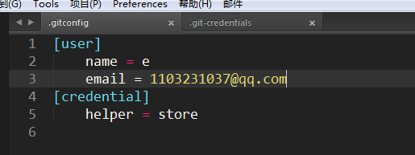
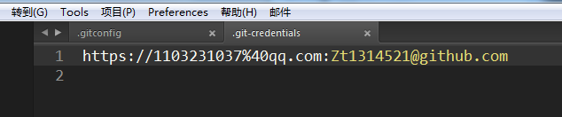

# git使用

## 1.安装好git之后第一次配置

### 1.1设置姓名 + 邮箱

```
$ git config --global user.name "ljh"
$ git config --global user.email 123456789@example.com

```

### 1.2设置记住密码，不用每次提交都输入密码
先执行下面语句：然后再提交一次，输入账号密码，本地git就记住了，以后commit就不需要再次输入账号密码了。
```
git config --global credential.helper store
```
C:\Users\Administrator:是本地git的配置文件
<br/>

<br/>

<br/>

