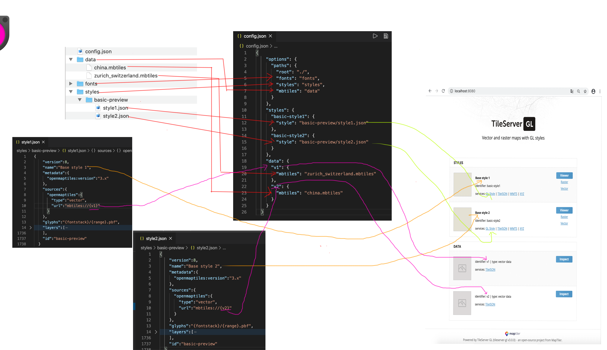

# mapbox离线搭建基础

本文将依据`Tileserver GL`官方文档, 针对文档上不详细的地方做针对的解释和实操，自己搭建一个离线的mapbox服务。

`https://tileserver.readthedocs.io/en/latest/installation.html`

当然了除了使用`Tileserver GL`，geoserver也可以搭建mapbox，但是本文不做介绍。

## 一、准备工作

1. linux系统，本文是基于centos7，并检查是否能联上网络。
2. docker基础，部署的时候会用到docker 的命令。
3. mbtiles文件下载
   1. `https://openmaptiles.com/downloads/planet/`
   2. [zurich_switzerland.mbtiles](https://github.com/maptiler/tileserver-gl/releases/download/v1.3.0/zurich_switzerland.mbtiles)

## 二、下载镜像并配置启动

### 1. 下载tileserver-gl镜像

```
docker pull maptiler/tileserver-gl
```

### 2. 创建文件目录

centos上选定一个路径，然后创建以下文件和文件夹，本文所有文件在`/root/mapbox_server/`下。

```
|--data/            				# 放置mapbox的xxx.mbtiles文件
|--fonts/           				# 放置系统字体文件，具体在styles目录里面会用到
		|--Noto Sans Regular
		  |--0-255.pbf
		  ...
		  |--65280-65535.pbf
|--styles/          				# 放置mapbox的style.json文件
   |--basic-preview/
      |--style1.json
      |--style2.json
|--sprites/         				# 放置雪碧图的目录，具体在styles目录里面会用到
|--config.json      				# tileserver-gl启动的配置文件
```

#### 2.1 一些简单的文件配置：

1. config.json

```
{
    "options": {
      "paths": {
        "root": "./",
        "fonts": "fonts",
        "styles": "styles",
        "mbtiles": "data"
      }
    },
    "styles": {
      "basic-style1": {
        "style": "basic-preview/style1.json"
      },
      "basic-style2": {
        "style": "basic-preview/style2.json"
      }
    },
    "data": {
      "v1": {
        "mbtiles": "zurich_switzerland.mbtiles"
      },
      "v2": {
        "mbtiles": "china.mbtiles"
      }
    }
  }
```

2. Styles-->basic-preview->style1.json和style2.json

   ```
   {
       "version":8,
       "name":"Base style 1",
       "metadata":{
         "openmaptiles:version":"3.x"
       },
       "sources":{
         "openmaptiles":{
           "type":"vector",
           "url":"mbtiles://{v1}"
         }
       },
       "glyphs":"{fontstack}/{range}.pbf",
       "layers":[
       ...这里是所有的layer配置，
       ...具体参考https://github.com/klokantech/tileserver-gl-styles
       ],
       "id":"basic-preview"
     }
   ```

3. fonts文件夹

   直接复制https://github.com/klokantech/tileserver-gl-styles里面的fonts，也可以自己制作。

4. data文件夹

   data文件夹放置的是所有的xxx.mbtiles文件

   这里可以直接使用官网提供的[zurich_switzerland.mbtiles](https://github.com/maptiler/tileserver-gl/releases/download/v1.3.0/zurich_switzerland.mbtiles)，下面是具体下载路径，

   ```
   https://github.com/maptiler/tileserver-gl/releases/download/v1.3.0/zurich_switzerland.mbtiles
   ```

   

   在上面的config.json文件里面有如下代码

   ```
    "v2": {
    		"mbtiles": "china.mbtiles"
    }
   ```

   其中的 china.mbtiles 文件是从`https://openmaptiles.com/downloads/planet/` 下载的，也可以下载其他区域的文件。如果只用到了zurich_switzerland.mbtiles做演示，就把config里面下面的这2段代码注释掉。

   ```
   "basic-style2": {
   		"style": "basic-preview/style2.json"
   }
   ```

   ```
    "v2": {
    		"mbtiles": "china.mbtiles"
    }
   ```

   

### 3. 启动服务

​	

```
docker run -it -v $(pwd):/data -p 8080:80 maptiler/tileserver-gl
```

完了可以crtl+p+q退出，也可以使用下面你的命令直接后台启动。

```
docker run -itd\
 --restart always\
 -v $(pwd):/data\
 -p 8080:80 maptiler/tileserver-gl
```

这里都是docker命令，具体请查阅docker操作。


浏览器打开：

http://localhost:8080/ 就可以看到如下页面。


## 三、针对上面的配置链路说明



## 四、config.json文件详解

```
{
  "options": {
    "paths": {                  # 定义数据文件夹位置
      "root": "./",             # 文件夹前缀，可以是一个具体的路径或者相对路径./
      "fonts": "fonts",       	# 字体库文件夹
      "sprites": "sprites",     # 雪碧图文件夹
      "styles": "styles",       # 地图style.json文件夹 
      "mbtiles": "data"         # 地图数据源 xxx.mbtiles文件夹     
    },
    "domains": [                # 设置渲染图块可访问的域，一般不设置，
      "localhost:8080",
      "127.0.0.1:8080"
    ],
    "formatQuality": {          # 单个图像格式的压缩质量比例。[0-100]
      "jpeg": 80,
      "webp": 90
    },
    "maxScaleFactor": 3,        # 设置请求图片的最大缩放级别(例如：@3x suffix)，默认3，最大9
    "maxSize": 2048,            # 设置图片最大尺寸
    "pbfAlias": "pbf",          # pbf别名
    "serveAllFonts": true,      # 使用所有字体
    "serveAllStyles": true,     # 使用所有styles
    "serveStaticMaps": true,    # 使用所有静态地图
    "tileMargin": 0             # 给tile加margin，耗性能，默认为0禁用此处理。
    "minRendererPoolSizes": [8,4,2],
    "minRendererPoolSizes": [16, 8, 4],
    "watermark": "powered by jiusuo" # 水印，渲染到地图左下角
  },
  "styles": {                   
    "basic": {                  # 样式名
      "style": "basic.json",    # 样式源文件
      "tilejson": {             # 添加到为栅格数据创建的TileJSON的属性  
        "type": "overlay",
        "bounds": [8.44806, 47.32023, 8.62537, 47.43468]
      }
    },
    "hybrid": {
      "style": "satellite-hybrid.json",
      "serve_rendered": false,  # 是否渲染此样式的栅格图块
      "tilejson": {
        "format": "webp"
      }
    }
  },
  "data": {                     # 每一项都指定一个数据源，服务器应该可以访问该数据源
    "zurich-vector": {
      "mbtiles": "zurich.mbtiles"   # mbtiles文件的名称[必填]
    }
  }
}
```


### 目前使用的config.json

```
{
  "options":{
    "paths": {
      "root": "./",
      "fonts": "fonts",
      "sprites": "sprites",
      "styles": "styles",
      "mbtiles": "data"
    },
    "formatQuality": 100,
    "maxScaleFactor": 4,
    "maxSize": 2048,
    "pbfAlias": "pbf",
    "serveAllFonts": true,
    "serveStaticMaps": true,
    "maxRendererPoolSizes": [2048, 1026, 512],
    "watermark": "powered by zonebond"
  },
  "styles":{
    "xian": {
      "style": "xian/base.json",
      "serve_data": true
    },
    "metro": {
      "style": "xian/metro.json",
      "serve_data": true
    },
    "traffic": {
      "style": "xian/traffic.json",
      "serve_data": true
    },
    "boundaries": {
      "style": "xian/boundaries.json",
      "serve_data": true
    },
    "dark-base": {
      "style": "xian/dark-base.json",
      "serve_data": true
    }
  },
  "data": {
  	"building-ext-1": {
      "mbtiles": "building-ext-1.mbtiles"
    },
  	"building-ext-2": {
      "mbtiles": "building-ext-2.mbtiles"
    },
  	"metro-stops-value": {
  	  "mbtiles": "metro-stops-value.mbtiles"
  	},
  	"boundaries": {
  	  "mbtiles": "xian-place-boundaries.mbtiles"
  	},
    "monit-roads": {
  	  "mbtiles": "xian-monit-roads.mbtiles"
  	},
  	"transportation": {
  	  "mbtiles": "xian-transportation.mbtiles"
  	},
  	"xian-poi-2020-03-17": {
      "mbtiles": "xian-poi-2020-03-17.mbtiles"
    },
    "asia_china": {
      "mbtiles": "osm-2020-02-10-v3.11_asia_china.mbtiles"
    }
  }
```

```
docker run -itd --name 'xian-v2' --restart always -p 8090:81 mapbox:xian-v2

http://localhost:8090/gl_styles/xian/style.json?ppx=6903e6c322b40ec06678365fba498dd9
```


## 五、打包成一个docker镜像

为了方便运维部署，如果地图服务相对稳定的话，我们可以使用docker 来部署，下面演示下使用docker 生成并部署一个地图镜像

1. 文件目录， 

   

在当前文件夹创建Dockerfile文件和mapbox的数据目录，其中run.sh是容器内部启动mapbox 的命令文件。

Dockerfile文件：

```
FROM maptiler/tileserver-gl

WORKDIR /data

COPY mapbox /data

RUN chmod 777 ./run.sh

ENTRYPOINT [ "sh", "./run.sh" ]

EXPOSE 80
#CMD [ "sh", "./run.sh" ]
```

run.sh文件

```
#!/bin/bash
 
sh -c /usr/src/app/run.sh
```

剩下的文件夹都是第二大步骤的文件夹内容。

2. 执行创建镜像命令

   在Dockerfile文件目录执行：

```
docker build -t 镜像名:版本 .
```

3. run运行命令

   ```
   docker run -it -p 8080:80 镜像名:版本
   ```

4. 将镜像保存成tar包，方便保存

   ```
   docker save -o > 文件名.tar 镜像ID
   ```

   然后就会在当前目录生成一个 tar文件，就可以copy给别人了。

5. 拿到tar包后在新的docker机器上部署

   在tar文件夹目录执行：

   ```
   docker load -i < 文件名.tar
   ```

   就会将tar文件加载到docker镜像中去，然后执行run就可以了

## 六、style文件相关网址

###### mapbox studio 官方style.json样式编辑；

https://studio.mapbox.com/


###### maputnik开元style.json编辑，可离线安装；

https://github.com/maputnik/editor