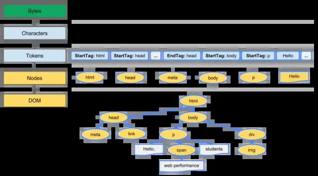
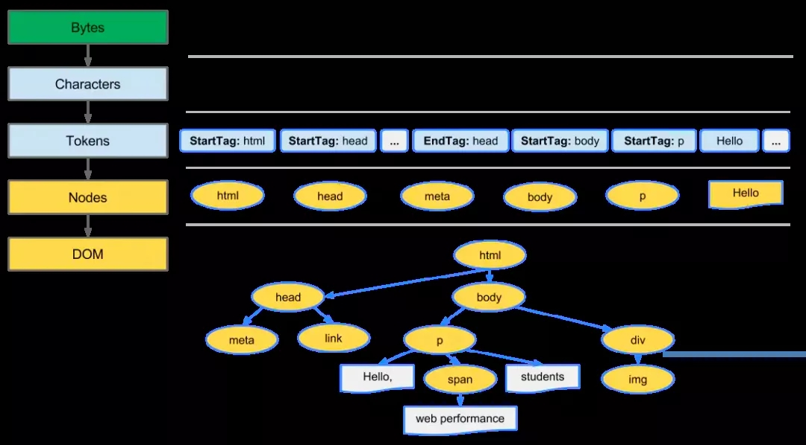

# 浅谈浏览器渲染、回流和重绘

## 概要

1. 浏览器渲染的本质；

2. 介绍回流 reflow 和重绘 repaint；

3. 如何优化性能；

## 浏览器渲染
一个普通的网页，浏览器在渲染前需要先构建 DOM（document object model） 和 CSSOM (css object model） 树。

## DOM
DOM 树是怎么来的呢？我们先假设有一个网页由一些文本，一幅图片组成：

浏览器会经过：

* 转换：浏览器从磁盘或网络读取 HTML 的原始字节，并根据文件的指定编码将它们转换成各个字符。

* 令牌化：浏览器将字符串转换成 W3C 标准规定的各种令牌，例如，“”、“”，以及其他尖括号内的字符串。每个令牌都具有特殊含义和一组规则。

* 词法分析：令牌转换成定义其属性和规则的“对象”。

* DOM 构建：由于 HTML 标记定义不同标记之间的关系（一些标记包含在其他标记内），创建的对象链接在一个树数据结构内，此结构也会捕获标记中定义的父子关系：HTML 对象是 body 对象的父项，body 是 paragraph 对象的父项，依此类推。

整个过程的最终输出是我们这个普通页面的文档对象模型 (DOM)，浏览器对页面的后续处理都会用到它

## CSSOM

与处理 HTML 时一样，浏览器引擎需要将收到的 CSS 规则转化成浏览器能理解和处理的东西。

CSS 字节转换成字符，接着转换成令牌和节点，最后链接到一个称为“CSS 对象模型”(CSSOM) 的树结构内。构建 CSSOM 树是一个十分消耗性能的过程。

最后 CSSOM 树和 DOM 树合并成渲染树，并用它计算每个可见元素的布局，然后输出给绘制流程，最终将像素渲染到屏幕上。

## 回流 reflow 和重绘 repaint

> reflow 有些地方译成重排。

字面意思上理解重绘：重新描绘某个区域。

理解回流要复杂一些，我们增删 DOM 节点，修改一个元素尺寸，页面布局和 DOM 树结构发生变化，肯定需要重新构建 DOM 树，而 DOM 树与渲染树是紧密相连的，DOM 树构建完，渲染树也会随之对页面进行再次渲染。

重绘：对 DOM 操作简单修改样式（比如修改元素的 visibility、color、background-color 等）、却并未影响页面布局时，浏览器不需重新计算元素的位置尺寸等，直接为该元素绘制新的样式。这个过程叫做重绘。

回流：对 DOM 操作导致 DOM 尺寸等属性的变化（比如修改元素的 width、height、top）时，浏览器需要重新计算元素的属性，然后再将计算的结果绘制出来，这个过程叫做回流。

常见的会导致回流的操作：

* 页面首次加载

* 浏览器窗口尺寸改变

* 元素尺寸或位置改变

* 元素内容变化

* 元素字体大小变化

* 增删 DOM 元素

* 查询或调用某些特定属性方法

总结：

* 回流往往代价比重绘大；

* 回流一定重绘，重绘未必回流。

## 现代浏览器优化
因为频繁修改 DOM 或 CSSOM 本身是件特别耗费性能的事情，现代浏览器大多对于都做了一定的优化。比如会把一系列的操作放进队列机制来批量更新布局，至少一个浏览器刷新帧 16ms（即大多数显示屏幕的刷新率为 60Hz,一个刷新间隔为 1000ms/60）才会清空队列（节流优化~）。

但在获取布局尺寸等信息的时候，为了保证数据的准确性，队列中无论有没有会影响这些属性或方法返回值的操作，浏览器也会强制清空队列，触发回流与重绘。（ IE 不保证有这些优化）

* offsetTop、offsetLeft、offsetWidth、offsetHeight

* scrollTop、scrollLeft、scrollWidth、scrollHeight

* clientTop、clientLeft、clientWidth、clientHeight

* width、height

* getComputedStyle()

* getBoundingClientRect()

## 优化回流和重绘

* 避免使用 CSS 表达式；

* 使用 transform 替代 top；

* CSS3 硬件加速（GPU 加速）；

* 离线操作 DOM：把元素脱离文档流，然后对元素进行修改，这样只会导致重绘，而不会造成回流。
  * display:none：临时把元素 脱离文档流，进行批量操作后再放回。这样只会有一次回流；

  * createDocumentFragment：创建文档片段，一次性把内容放进文档；

* 尽可能在 DOM 树的最末端改变 class：减小回流的范围；

* 将动画效果应用到 position 属性为 absolute 或 fixed 的元素上，避免影响其他元素的布局，这样只是一个重绘，而不是回流；

* JS 避免频繁读取会引发回流/重绘的属性：如果需要频繁使用，可以用变量把它缓存下来。